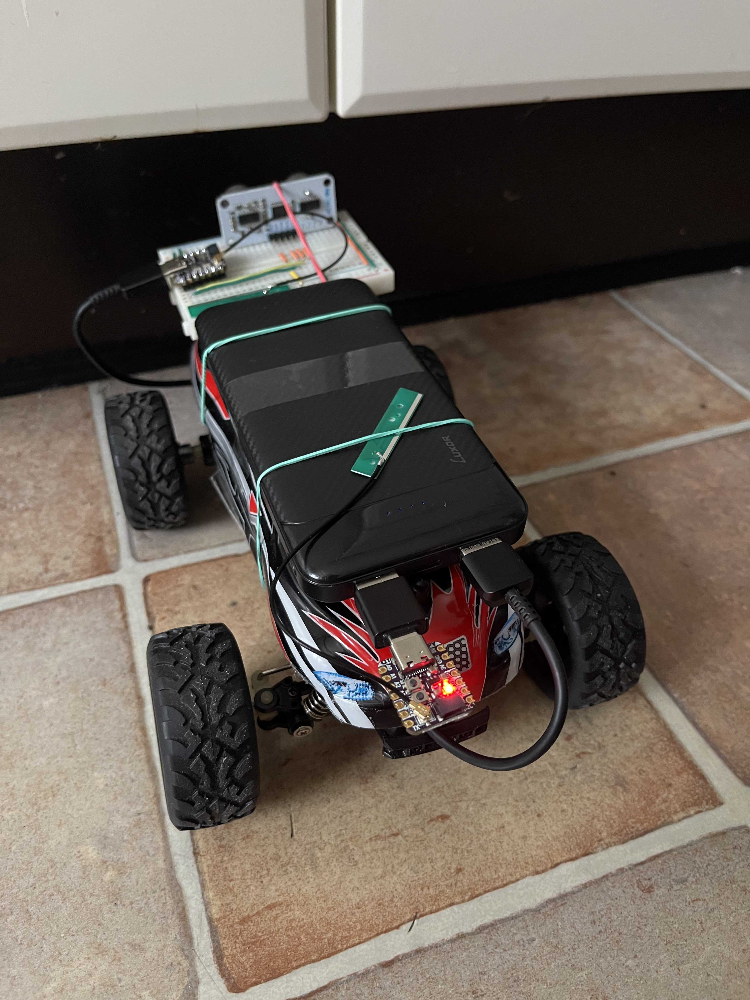
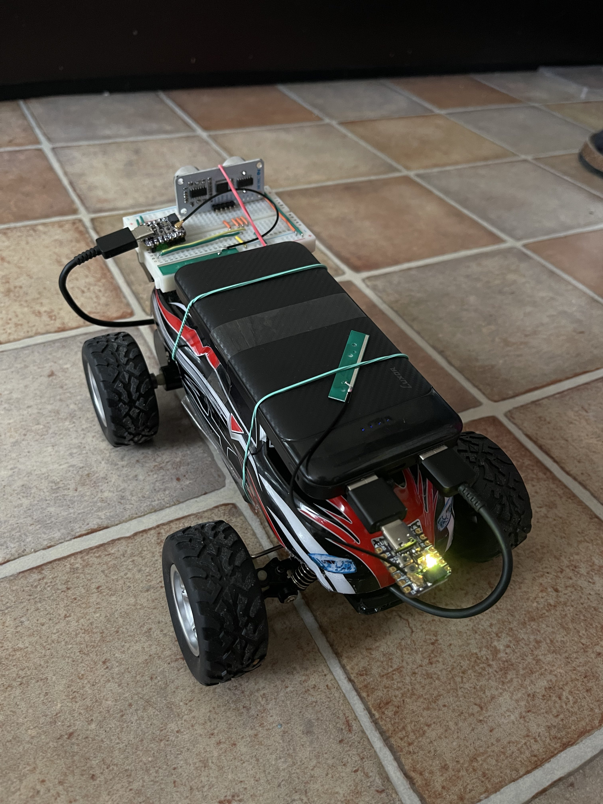
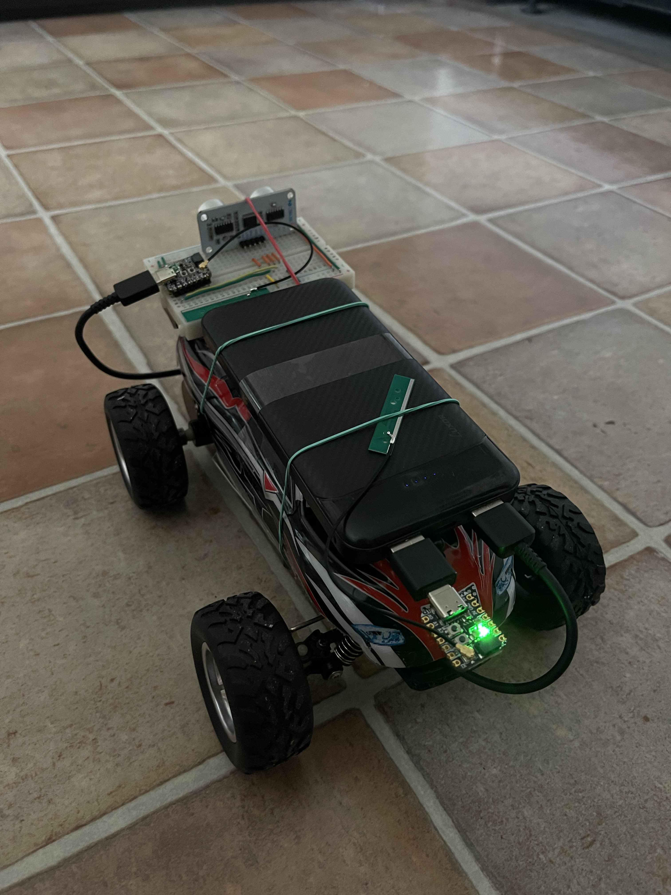

# Parking_sensor_IOT_ESP32_Demo
This repo holds the code for both the ESP responsible for collecting data and the one that shows it

## About
This project uses 2 ESP32 S2 devices that act as server and client, the Server holds the sensor and sends the distance over a REST API to the Client that will light up a NEO Pixel in red, yellow or green depending on distance.

https://user-images.githubusercontent.com/32038561/211026019-7e3211f0-09d0-4d64-8109-37414cc355ba.mov

